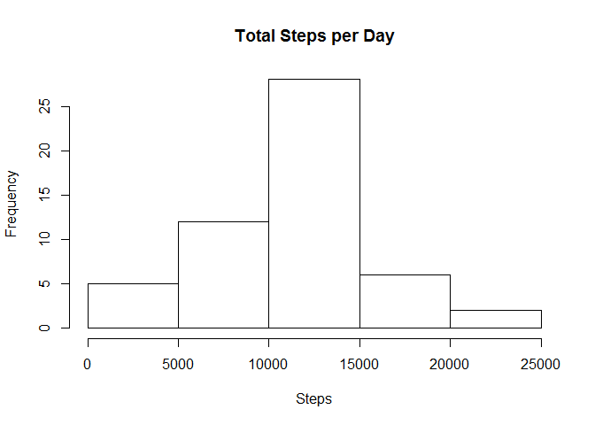
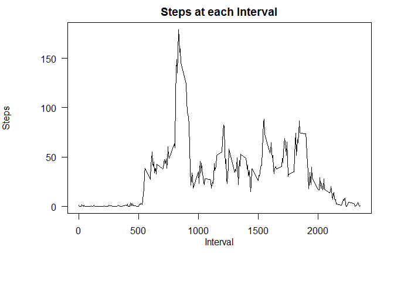
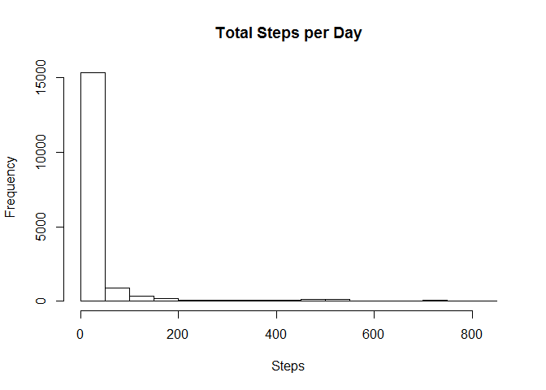
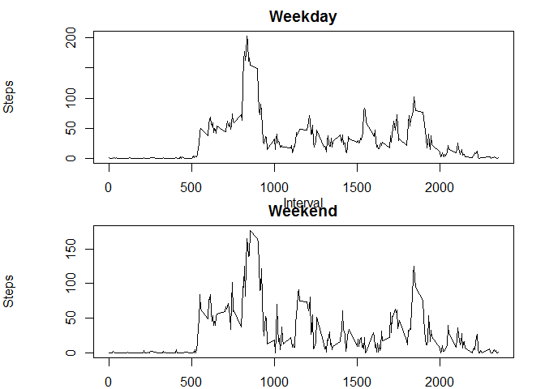

#Peer Assessment 1 for Reproducible Research#

The following report details the steps and and the answers to Peer Assignment 1 for Reproducible Research

##Loading and preprocessing the data##

```r
setwd("~/IDA/Reproducible Research")
data<-read.csv("activity.csv",head=TRUE,sep=",",colClasses=c("numeric","character","numeric"))
library(ggplot2)
```

```
## Warning: package 'ggplot2' was built under R version 3.1.2
```

```r
library(dplyr)
```

```
## 
## Attaching package: 'dplyr'
## 
## The following object is masked from 'package:stats':
## 
##     filter
## 
## The following objects are masked from 'package:base':
## 
##     intersect, setdiff, setequal, union
```

##What is mean total number of steps taken per day?##

###Histogram of the total number of steps taken each day.###

```r
totalsteps<-data%>%group_by(date)%>%summarise_each(funs(sum)) ## this gets you the total steps taken each day.
hist(totalsteps$steps,xlab="Steps",main="Total Steps per Day") ## this creates the histogram.
```

 

###Mean and median total number of steps taken per day.###

```r
summary(totalsteps$steps)## the mean and median steps per day is reported here.
```

```
##    Min. 1st Qu.  Median    Mean 3rd Qu.    Max.    NA's 
##      41    8841   10760   10770   13290   21190       8
```

##What is the average daily activity pattern?##

-the following code chunk gets the mean number of steps taken over the time intervals and;
-resolves the missing values issue.


```r
meansteps<-data%>%group_by(date)%>%summarise_each(funs(mean)) ## mean steps taken over the time intervals
step<-data[,1] ##getting rid of the missing values
step[is.na(step)]<-0
inter<-cbind(data,step)
inter<-data.frame("interval"=inter[,3],"steps"=inter[,4])
inter<-inter%>%group_by(interval)%>%summarise_each(funs(mean))
```

###Plot for average steps across intervals.###

```r
par(mar=c(6,6,2,2)) ## steps at each interval (on average)
plot(inter$interval,inter$steps,xaxt="n", yaxt="n", xlab="", ylab="",type="l")
axis(1,at=pretty(inter$interval),labels=pretty(inter$interval),las=1)
axis(2,at=pretty(inter$steps),labels=format(pretty(inter$steps),big.mark=",", scientific=FALSE),las=1)
mtext(text="Interval", side=1, line=2,cex=1)
mtext(text="Steps", side=2, line=5,cex=1)
title("Steps at each Interval")
```

 

###5-minute interval, on average across all the days in the dataset which contains the maximum number of steps###


```r
order(inter$steps) ## highest number of steps
```

```
##   [1]   9  17  24  25  26  28  29  31  33  34  37  38  39  40  47  48  52
##  [18]  61 279   5  46 274   3  12  30   4  15  20  21  41  32 287  23  11
##  [35]  13 273   2  16  53  54  22  45   7  44  42 286  56  14  58 280   8
##  [52]  36  50 281 288  18  60  27  49 265  10  35  62 282 275  43   1  19
##  [69]   6  67 272  64  51 283 264 278  66  63  59 277 285  65  57 266  55
##  [86] 276 284 267  68 269 262 258 263 268 261 270 271 257 259 253  69 260
## [103] 177 254  70 242 256 243 249 241 252 234 120 246 135 250 248 255 117
## [120] 131 164 136 238 178 138 153 245 122 247 235 176 130 137 134 181 237
## [137] 133  73 132 251 152 244 139 240 129 215 119 173 183 182 233  83 128
## [154] 216 174 154 200 118 184 125  80  71 158 165 236 121 217 160 175 141
## [171] 157 123 163 159 171 179 204 180  85 199  81  82 127  92  86  72 142
## [188] 201 155 116 202 239 185 143 203 161 205  78 167 186 187 172  84  74
## [205]  89  77 140 150  87 207 126  90 170  79  93 124 232 166  75 151  88
## [222]  91 169  96 206 162 214 197  95 218 231 144 221 212 198 168 208 193
## [239] 196 149  76 145 194 188 115 156 222  98 211  94 209  97 224 195 219
## [256] 213 223 230 210 189 192 229 220 225 228 227 146 148 147 114 190 226
## [273] 191 113 112 111 110  99 109 102 100 108 101 103 106 107 105 104
```

```r
inter[104,1] ## interval with highest number of steps
```

```
## Source: local data frame [1 x 1]
## 
##   interval
## 1      835
```

##Imputing missing values.##

###Number of missing values in the dataset.###

```r
sum(is.na(data)) ## number of missing values
```

```
## [1] 2304
```

###The following code chunk resolves the missing values issue.###

```r
missing<-data[,1] ##getting rid of the missing values
missing[is.na(missing)]<-0
```

###New dataset with the missing values filled in.###

```r
full<-cbind(data,missing)
complete<-data.frame("date"=full$date,"interval"=full$interval,"steps"=full$missing)
```

###Histogram of the total number of steps taken each day and a report on the mean and median total number of steps taken per day.### 

-the readings are affected by the new data and the histogram of the steps over time interval becomes skewed, as compared to the normal distribution seen earlier.


```r
hist(complete$steps,xlab="Steps",main="Total Steps per Day")
```

 

```r
summary(complete$steps) ##mean and median steps per day with the full data
```

```
##    Min. 1st Qu.  Median    Mean 3rd Qu.    Max. 
##    0.00    0.00    0.00   32.48    0.00  806.00
```

##Are there differences in activity patterns between weekdays and weekends?##

-the following code chunks create the new datasets for the weekday and weekend readings.

```r
days<-weekdays(as.POSIXct(complete[,1]),abbreviate=FALSE) ##convert to weekdays and weekends
Day<-cbind(complete[,2],complete[,3],days)
Day<-data.frame("interval"=as.numeric(Day[,1]),"steps"=as.numeric(Day[,2]),"days"=Day[,3])

head(Day)
```

```
##   interval steps   days
## 1        0     0 Monday
## 2        5     0 Monday
## 3       10     0 Monday
## 4       15     0 Monday
## 5       20     0 Monday
## 6       25     0 Monday
```

```r
table(Day$days)
```

```
## 
##    Friday    Monday  Saturday    Sunday  Thursday   Tuesday Wednesday 
##      2592      2592      2304      2304      2592      2592      2592
```

```r
weekday<-list("Monday","Tuesday","Wednesday","Thursday","Friday")
weekend<-list("Saturday","Sunday")              

M2F<-NULL
for(i in 1:5){
    M2F<-rbind(M2F,subset(Day,days==weekday[i]))
}
WE<-NULL
for(i in 1:2){
    WE<-rbind(WE,subset(Day,days==weekday[i]))
}
weekday<-M2F%>%group_by(interval)%>%summarise_each(funs(mean))## this is the weekday readings
weekend<-WE%>%group_by(interval)%>%summarise_each(funs(mean)) ## this is the weekend readings
```

###Panel plot showing the weekday and weekend steps over time interval readings.###

```r
par(mfrow=c(2,1))
par(mar=c(2,6,2,2))
plot(weekday$interval,weekday$steps,type="l",xlab="",ylab="")
mtext(text="Interval", side=1, line=2,cex=1)
mtext(text="Steps", side=2, line=5,cex=1)
title("Weekday")
par(mar=c(2,6,2,2))
plot(weekend$interval,weekend$steps,type="l",xlab="",ylab="")
mtext(text="Interval", side=1, line=2,cex=1)
mtext(text="Steps", side=2, line=5,cex=1)
title("Weekend")
```

 

#The End.#
